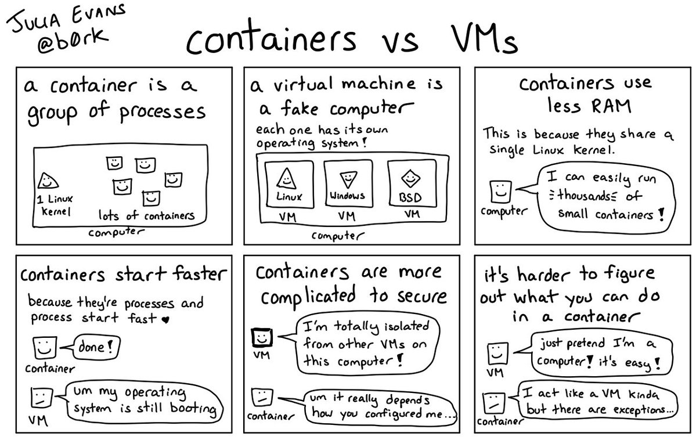
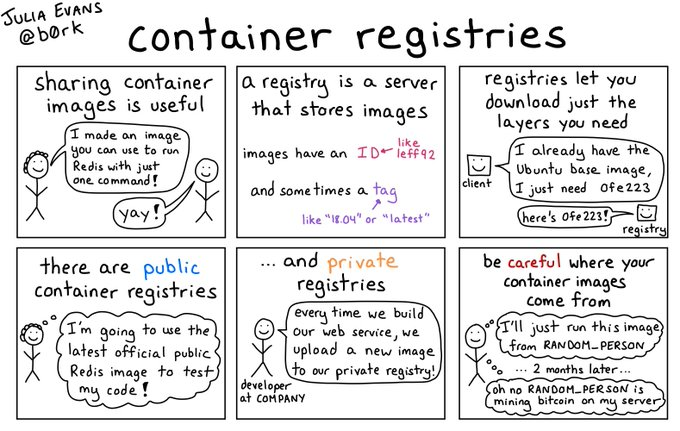
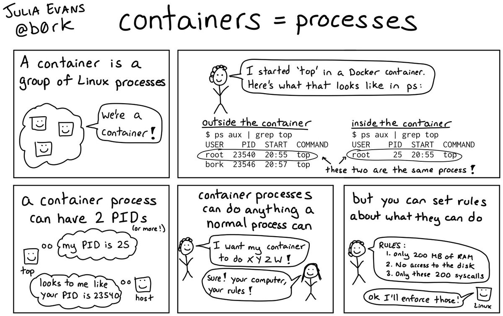
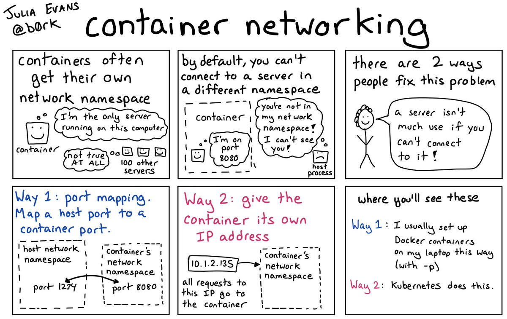

<!-- markdownlint-disable MD033 -->
<!-- markdownlint-disable MD024 -->
# Chapter 1: The Basics

In this chapter you will learn about container images and how to get them to run locally on your computer.

## Contents

1. [Docker images](#images)
2. [Running commands in containers](#commands)
3. [Container processes](#processes)
4. [Interacting with containers](#interacting)
5. [Basic networking](#networking)

---



---

## 1.1. Docker images <a name="images"></a>

Docker containers are created from *images*. An *image* is a bit like a template, from which a container can be instantiated and run. So, the very first thing you need in order to run any docker containers is the appropriate *image*.

### Image registries

Docker image registries are web services where Docker images live until you want to fetch and run them. There are:

* Public registries - like *Docker hub*.

* Private registries - like *hub.molnet.svt.se*, where most of SVT:s Development teams store their images.

The docker command assumes that you want to use *Docker hub* unless you specify another repository.

#### Searching for images

You can search Docker hub for images using the `search` option:

```sh
$ docker search "ubuntu"
NAME                                                      DESCRIPTION                                     STARS               OFFICIAL            AUTOMATED
ubuntu                                                    Ubuntu is a Debian-based Linux operating sys…   10533               [OK]
dorowu/ubuntu-desktop-lxde-vnc                            Docker image to provide HTML5 VNC interface …   394                                     [OK]
rastasheep/ubuntu-sshd                                    Dockerized SSH service, built on top of offi…   243                                     [OK]
consol/ubuntu-xfce-vnc                                    Ubuntu container with "headless" VNC session…   210                                     [OK]
ubuntu-upstart                                            Upstart is an event-based replacement for th…   105                 [OK]
ansible/ubuntu14.04-ansible                               Ubuntu 14.04 LTS with ansible                   98                                      [OK]
1and1internet/ubuntu-16-nginx-php-phpmyadmin-mysql-5      ubuntu-16-nginx-php-phpmyadmin-mysql-5          50                                      [OK]
ubuntu-debootstrap                                        debootstrap --variant=minbase --components=m…   42                  [OK]
nuagebec/ubuntu                                           Simple always updated Ubuntu docker images w…   24                                      [OK]
i386/ubuntu                                               Ubuntu is a Debian-based Linux operating sys…   19
1and1internet/ubuntu-16-apache-php-5.6                    ubuntu-16-apache-php-5.6                        14                                      [OK]
1and1internet/ubuntu-16-apache-php-7.0                    ubuntu-16-apache-php-7.0                        13                                      [OK]
ppc64le/ubuntu                                            Ubuntu is a Debian-based Linux operating sys…   13
1and1internet/ubuntu-16-nginx-php-phpmyadmin-mariadb-10   ubuntu-16-nginx-php-phpmyadmin-mariadb-10       11                                      [OK]
1and1internet/ubuntu-16-nginx-php-5.6                     ubuntu-16-nginx-php-5.6                         8                                       [OK]
1and1internet/ubuntu-16-nginx-php-5.6-wordpress-4         ubuntu-16-nginx-php-5.6-wordpress-4             7                                       [OK]
1and1internet/ubuntu-16-apache-php-7.1                    ubuntu-16-apache-php-7.1                        6                                       [OK]
darksheer/ubuntu                                          Base Ubuntu Image -- Updated hourly             5                                       [OK]
1and1internet/ubuntu-16-nginx-php-7.0                     ubuntu-16-nginx-php-7.0                         4                                       [OK]
pivotaldata/ubuntu                                        A quick freshening-up of the base Ubuntu doc…   3
pivotaldata/ubuntu16.04-build                             Ubuntu 16.04 image for GPDB compilation         2
smartentry/ubuntu                                         ubuntu with smartentry                          1                                       [OK]
1and1internet/ubuntu-16-sshd                              ubuntu-16-sshd                                  1                                       [OK]
1and1internet/ubuntu-16-php-7.1                           ubuntu-16-php-7.1                               1                                       [OK]
pivotaldata/ubuntu-gpdb-dev                               Ubuntu images for GPDB development              1

```

### Practice: Search for interesting images

Try searching for a Docker image for a software package or service you use regularly. There are images for everything from web servers to databases. Which image is the "official" one? You can also browse the public Docker Hub registry in a browser at <https://hub.docker.com>. (You don't need to sign up, just use the search box or scroll down to browse different categories of images.)

When you want to run a container, you must always specify what image it should be based on. In fact, it is the only mandatory parameter to the `docker run` command.

### Practice: Running a docker container from an image

Try running a container based on the official Ubuntu docker image. The syntax is:

```sh
docker run IMAGE
```

The official Ubuntu image is at the top of the search result list, named simply "ubuntu".

<details>

<summary>Hint</summary>

The complete command should look like this:

```sh
docker run ubuntu
```

</details>

#### How you'll know it worked

You should see the following output:

```sh
Unable to find image 'ubuntu:latest' locally
latest: Pulling from library/ubuntu
5c939e3a4d10: Pull complete
c63719cdbe7a: Pull complete
19a861ea6baf: Pull complete
651c9d2d6c4f: Pull complete
Digest: sha256:8d31dad0c58f552e890d68bbfb735588b6b820a46e459672d96e585871acc110
Status: Downloaded newer image for ubuntu:latest
```

You may also see no output at all! In fact, try re-running the command. Why is there no output this time?

<details>

<summary>Hint</summary>

The output from the first command is actually the output from the subprocess *fetching* the image from the library. It does the equivalent of

```sh
docker pull ubuntu
```

Once the image has been fetched, it is stored locally and will not need to be fetched again unless it is updated upstream.

</details>

You can see and manipulate locally stored images with the command

```sh
docker images
```

Look at the output: Images have *IDs*, *names* and *tags* to help identify them. An ID refers to a specific tag in a specific repository name. Images are usually tagged with a version number or `latest` to indicate the current version.

### More resources

* [The `docker image` command reference](https://docs.docker.com/engine/reference/commandline/image/)
* [Docker hub Quickstart](https://docs.docker.com/docker-hub/)
* [Docker Images 101](https://www.aquasec.com/wiki/display/containers/Docker+Images+101)  

---



---

## 1.2 Running things in containers  <a name="commands"></a>

OK, so there was some output from the last command, but nothing really *happened* in that container, right? The reason for this is simply that the Ubuntu image does not have instructions to actually do anything when it is run - it only provides a simulated Ubuntu environment for *you* to run commands in. If we want to make the container actually do something, we have to provide it with some more instructions.

The complete syntax for the `docker run` command is:

```sh
docker run [options] IMAGE [COMMAND]
```

### Practice: Hello Docker - Running a single command in a Docker container

Use the `docker run` command to run some command(s) in the Ubuntu container that output some text.

<details>

<summary>Hint</summary>

```sh
docker run ubuntu echo "Hello Docker"
```

Will output the string "Hello Docker" when run.

</details>

#### How you'll know it worked

Your chosen message should appear as the output from the command.

### More resources

* [The `docker run` command reference](https://docs.docker.com/engine/reference/run/)
* [Linuxize - The Docker Run Command with Examples](https://linuxize.com/post/docker-run-command/)

---

## 1.3. Container processes <a name="processes"></a>

Let's try running something that doesn't exit quite as quickly. In fact, let's run a command that should never exit by itself. Try the following:

```sh
docker run ubuntu /bin/bash -c 'while true; do echo $(date); sleep 10; done'
```

The resulting container's job is to print the date and time every 10 seconds. It will continue to do so indefinitely unless we stop it somehow.

To manage continuously running containers like this one we can use the `docker ps` command. It outputs information about all running containers, such as their *Container ID*, what image they use, what commands they are running, and their age.

When we know a container's *Container ID*, we can manage it further. The `docker kill` command is used to stop a running container.

```sh
docker ps # Show information about running containers
```

```sh
docker kill CONTAINERID # Stops the container with ID "CONTAINERID"
```

### Practice: ID and stop a running container

Open another terminal window and use `docker ps` and `docker kill` to find out the ID of the neverending date-printing container and kill it.

<details>

<summary>Hint</summary>

First you need to find out the container's ID using `docker ps`. The ID is listed in the leftmost column.

```sh
$ docker ps
CONTAINER ID        IMAGE               COMMAND                  CREATED             STATUS              PORTS               NAMES
d391fff4aff0        ubuntu              "/bin/bash -c 'while…"   11 minutes ago      Up 11 minutes                           hopeful_golick
```

In this example, the ID is *d391fff4aff0*. We can now stop the container using the `docker kill` command:

```sh
$ docker kill d391fff4aff0
d391fff4aff0
```

The command outputs the ID when it has run successfully.

</details>

#### How you'll know it worked

* The list of date/times in the first terminal window will finally stop updating!
* `docker ps` should no longer show any running containers.

If we miss our container we can still see its status using

```sh
docker ps -a # The switch "-a" tells the docker service to show us *all* containers, running or not!
```

Wow, look at all those stopped containers!

## 1.4. Interacting with containers <a name="interacting"></a>

Remember how we can run any command we want in a container? We can even run a shell! (If the image has one installed, that is. More on available commands later.)

### Practice: Getting inside a running container

Running an interactive shell in a container gives us hands-on access to everything in the image: Its file system, logs, and any processes it might run. Try it out:

```sh
docker run -ti ubuntu /bin/bash
```

*The `-ti` flags tell the docker service to allocate a virtual **t**ty and to listen to standard **i**nput on it, so that we can send commands to it. Or if you want a handy mnemonic: **T**ake **I**nput*.

Try looking around in the container filesystem. **What processes are running? How big is the filesystem? What command line tools are available? How much memory does it use?**

<details>

<summary>Hint</summary>

The only processes running should be the bash process you started with the `docker run` command - this is all the container is doing. The root filesystem looks to be about the same size as your computer's hard drive, and the available RAM looks like your computer's as well. Interesting.

In fact, since we have given the container no restrictions, it is free to use unlimited system resources including all CPU cores. We might want to adjust that in a later chapter.

As for available commands, all the usual system utilities are available in your `$PATH` - but no extras.

</details>

Type `exit` or press Ctrl+D to exit the interactive shell. **What happens to the container when you do this?**

<details>

<summary>Hint</summary>

The shell was the only process running in the container, so when the shell exits, so does the container. Verify this with `docker ps -a`!

</details>

---



---

### Practice: Catching some logs

The `docker log` command is very useful and will show logs from both running and stopped containers. The syntax is:

```sh
docker logs CONTAINERID
```

**Use `docker logs` to fetch the logs for the container that you just ran an interactive shell on.**

<details>

<summary>Hint</summary>

You will need to find out the ID of the (stopped) container you ran the interactive shell on using `docker ps -a`. Then the docker logs command - for example for the ID *ea992f7195b7*:

```sh
docker logs ea992f7195b7
```

</details>

#### How you'll know it worked

You should see all the commands you ran against the interactive shell and their output in the logs. The logs are a complete record of the interactive session!

## 1.5. Basic networking <a name="networking"></a>

Networking with Docker is a subject that can get very complicated very fast, but luckily when running docker on a workstation some basics are usually already in place. Your container probably has an IP address already, although we haven't seen it anywhere yet.

Go ahead and start a container running `/bin/bash` as before. Then in a second terminal, get the container's ID with `docker ps` and use it to find out more about the container using

```sh
docker inspect <containerid>
```

Look through the output for anything resembling an IP address.

The output actually contains a whole section of networking information:

```json
        "NetworkSettings": {
            "Bridge": "",
            "SandboxID": "283faa9717d0508a58331b7b325ab05da9cde945dea5c7cbf2ff30819c88b64e",
            "HairpinMode": false,
            "LinkLocalIPv6Address": "",
            "LinkLocalIPv6PrefixLen": 0,
            "Ports": {},
            "SandboxKey": "/var/run/docker/netns/283faa9717d0",
            "SecondaryIPAddresses": null,
            "SecondaryIPv6Addresses": null,
            "EndpointID": "0a447cd46ac333d03b4d9b9d6e038399bde1ed93fce50d13a2b43f9d62b91ee6",
            "Gateway": "172.17.0.1",
            "GlobalIPv6Address": "",
            "GlobalIPv6PrefixLen": 0,
            "IPAddress": "172.17.0.2",
            "IPPrefixLen": 16,
            "IPv6Gateway": "",
            "MacAddress": "02:42:ac:11:00:02",
            "Networks": {
                "bridge": {
                    "IPAMConfig": null,
                    "Links": null,
                    "Aliases": null,
                    "NetworkID": "68a2a291b3c2cb5c8d09a852bca517ce0db6688f8013d548076368ea9dd1af95",
                    "EndpointID": "0a447cd46ac333d03b4d9b9d6e038399bde1ed93fce50d13a2b43f9d62b91ee6",
                    "Gateway": "172.17.0.1",
                    "IPAddress": "172.17.0.2",
                    "IPPrefixLen": 16,
                    "IPv6Gateway": "",
                    "GlobalIPv6Address": "",
                    "GlobalIPv6PrefixLen": 0,
                    "MacAddress": "02:42:ac:11:00:02",
                    "DriverOpts": null
                }
            }
        }
```

And as we can see, the container has the IP address `172.17.0.2`. It is a private address on a /24 network that is managed by the docker daemon and only exists inside your computer. Every docker container you start gets assigned one automatically. Right now we aren't using it for anything, but it might come in useful later.

(There is *a lot* more to docker networking, but this is basically the default behaviour and it is what will usually happen if you run docker with the default configuration. Most of us never need to dig deeper than this, fortunately, but you should know that this is one specific scenario only and many many more exist out there.)

---



---

Congratulations, you have successfully run some docker containers! Good job. If you want to learn about baking some of your own, move on to [Chapter 2](../2-dockerfiles/README.md)!
